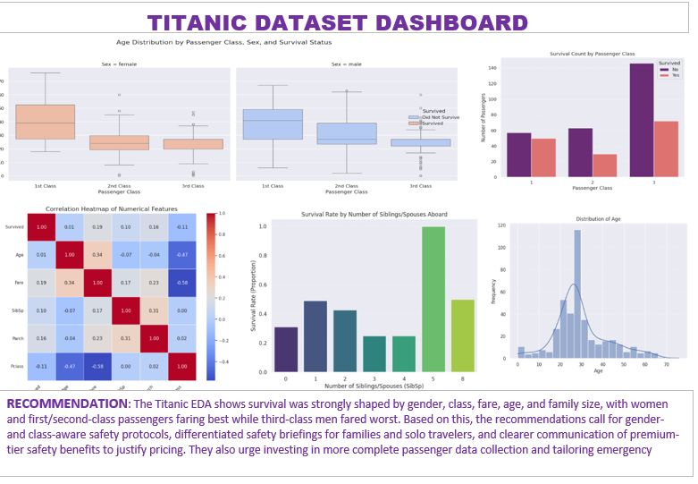

# TITANIC-PYTHON-PROJECT
Exploratory Data Analysis dashboard on the Titanic dataset — visualizing survival patterns by gender, class, age, fare, and family size.
An exploratory data analysis (EDA) dashboard examining survival patterns from the Titanic dataset (418 passengers), covering demographics, class, fare, and family structure.

The Key Visuals are:
Age distribution by passenger class, sex & survival status
Survival count by passenger class
Correlation heatmap of numerical features
Survival rate by number of siblings/spouses aboard
Overall age distribution

Key Insight
Survival was strongly shaped by gender, class, fare, age, and family size. Women and 1st/2nd-class passengers had the highest survival rates, while 3rd-class men fared worst.

Recommendation
Implement gender- and class-aware safety protocols, differentiated safety briefings for families vs. solo travelers, clearer communication of premium-tier safety benefits, and invest in more complete passenger data collection.

